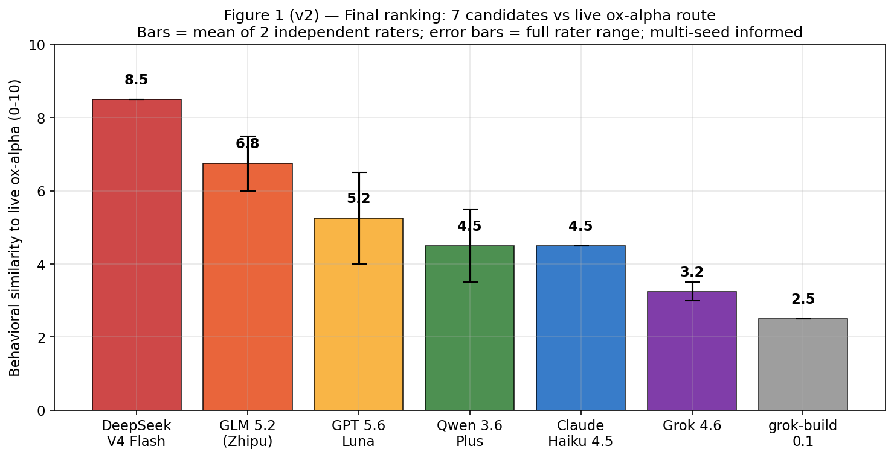

# OxAlphaTrace

**A Behavioral Fingerprinting Study of a Stealth Language Model**

Provenance ranking across seven candidate model families via observable behavior, blind attribution, and multi-seed stability analysis.



## Summary

> **Ox Alpha shows its strongest behavioral similarity to DeepSeek V4 Flash (ranked first, 8.5/10) and GLM-5.2 (second, 6.0–7.5/10).** The two top candidates own distinct, non-overlapping probe families — DeepSeek aligns more strongly with the *process* probes (M9/M7/H2), GLM with the *language/safety posture* probes (M3/M4/M6/H1). Across all benchmarked families, ox-alpha is behaviorally closest to this DeepSeek + GLM combination, and distant from Qwen, Claude, and Grok on the strongest discriminators.

*Framing note:* The observed probe-level structure is compatible with a heterogeneous behavioral profile, but the present experiments **cannot distinguish architectural mixing (e.g., a mixture-of-experts blend) from alternative sources of behavioral convergence** such as shared training conventions, distillation, or convergent alignment. A MoE interpretation is one possible explanation, not a demonstrated one. Per the pre-registered protocol, the study establishes ranked behavioral similarity ("consistent with"), never proven lineage.

## What this is

OxAlphaTrace is an experimental, behavior-only research project investigating whether the **observable behavior** of a stealth-served language model — `openrouter/stealth/ox-alpha` — can function as a measurable fingerprint for model comparison, attribution, and provenance analysis.

The work deliberately treats self-reported identity as *evidence, never ground truth*, and restricts every conclusion to "consistent-with" phrasing (see the pre-registered protocol in [`master.md`](master.md)).

## Key results

- **Phase I (benchmarks):** near-ceiling capability profile — identity consistency 1.00 (119/119 incl. adversarial frames), reasoning 19/20, reasoning consistency RCS = 1.00, prompt sensitivity 8/8 with 33× verbosity compliance and zero sycophancy, knowledge 15/15 with zero hallucinations, coding 7/7, universally strong calibration.
- **Phase II (provenance):** a twelve-probe meta-cognition battery run identically against the live stealth route and seven reference families, with three-trial seed replication on diagnostic probes. **Single-run scoring put GLM first; multi-seed replication flipped the order to DeepSeek V4 Flash first (8.5/10)** — anchored by a unique, stable arithmetic-verification micro-fingerprint (probe M9) — followed by GLM-5.2 (6.0–7.5/10). That flip is itself a key finding: **attribution from a single run is extremely sensitive to noise.** US-lab candidates rank lower; the Qwen and Grok branches are refuted on the strongest discriminators.

## The central methodological finding: attribution works and fails at the same time

- **It works:** consistent two-tier ranking across raters, with a unique, seed-replicable micro-fingerprint (M9).
- **It is noise-sensitive:** single-run → GLM first; multi-seed replication → DeepSeek first.
- **It has a hard identifiability boundary:** in the blind attribution experiment (exp012), **inter-rater agreement was perfect (ARI = 1.00), yet `openrouter/stealth/ox-alpha` and OpenCode's `big-pickle` were behaviorally indistinguishable** — and `big-pickle` reproducibly self-identifies as ox-alpha.

That boundary is the most important result. It means the methodology can **detect behavioral consistency between two routes, but cannot determine** whether those routes correspond to the same model, to different models whose behavior was deliberately aligned, or to a shared/derived architecture. **ARI = 1.00 between raters does not imply provenance.** Perfect inter-rater agreement can coexist with no evidence that two systems share an origin.

> **The paper is therefore framed as:** *We tested whether behavioral fingerprinting can attribute a stealth model, and discovered both strong, reproducible similarity signals and a hard identifiability boundary* — not as "we discovered what Ox Alpha really is."

## Repository layout

```
master.md                  Pre-registered research protocol & methodology
paper/
  manuscript/              Final paper (IEEE-style PDF, LaTeX, sources)
results/
  raw/                     Raw transcripts, reference corpora, seed replications
  processed/               Fingerprints, rater verdicts, attribution keys
  figures/                 Publication figures (Fig 1–7)
scripts/
  data_collection/         Reproducible collectors (PowerShell)
  visualization/           Figure + PDF rendering pipeline (Python)
.opencode/agents/          Auditor subagent definitions
```

## Reproducibility

Every number in the paper regenerates from artifacts in this repository:

- **Transcripts:** `results/raw/` (exp001–013, seven reference corpora, seed replications)
- **Verdicts & fingerprints:** `results/processed/`
- **Figures:** `scripts/visualization/make_figures*.py`
- **Paper PDF:** `scripts/visualization/render_ieee_pdf.py` (IEEE-style two-column layout)

## Ethical note

No jailbreak attempts were made; refusal experiments measured structure, never bypasses. No definitive provenance claim appears anywhere in this paper.

## License

MIT — see [LICENSE](LICENSE).
